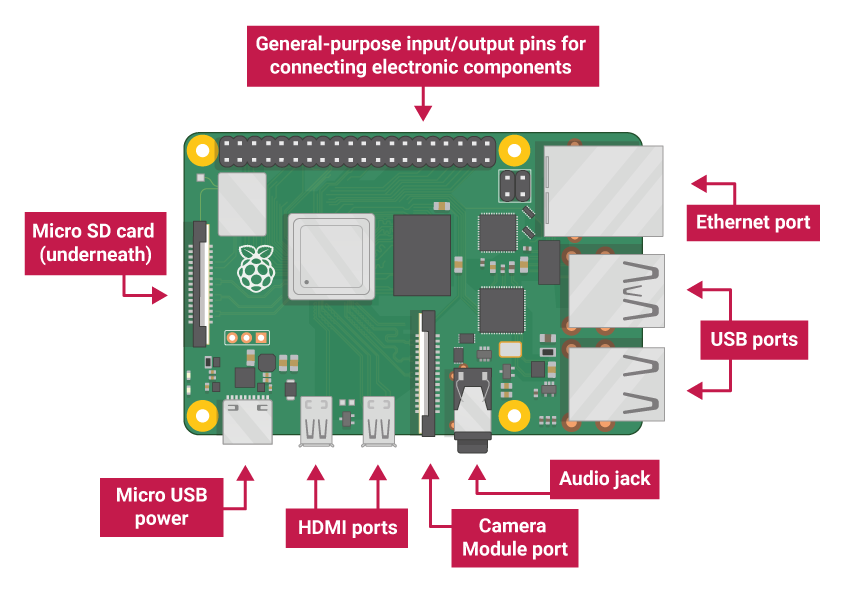

 

     

[](https://www.escuelaing.edu.co/)

# ICCS_PROJECT
Proyecto de internet de las cosas con convergencia en la ciberseguridad. Propósito de tener un proyecto que obtenga señales físicas y se actúe a esas señales a partir de un microcontrolador y que se use un tipo de comunicación muy usado mundialmente, para conectarse a un servidor local que permita guardar los datos y mantenerlos seguros.

## Índice
* [Propuesta Proyecto](#-PROYECTO-PROPUESTO)
* [Componentes a Usar](#componentes-a-usar)
* [LoRa WAN](#LoRa)
* [Función Sensores](#Función-Sensores)
* [Conexiones](#conexiones)
* [Base de datos](#base-datos-local)
* [Licencia](#licencia)


## PROYECTO PROPUESTO


## Componentes a Usar
<details>
<summary>LoRa RYLR998</summary>

### Modulo lora

[](https://www.amazon.com/-/es/M%C3%B3dulo-interfaz-RYLR998-certificaci%C3%B3n-antena/dp/B099RM1XMG)

Modulo lora que funciona por _UART_ siendo muy versátil y útil para microcontroladores simples. La forma en la que funciona este modulo es por comandos que el mismo fabricante recomienda usar y se pueden ver en el [manual](Documents/LoRa_AT_Command_RYLR998_RYLR498_EN.pdf).

Básicos comandos a usar:

>"AT" -> Verificación de conectividad
>
>"AT+ADDRESS=X" -> Indicar dirección 
>
>"AT+NETWORKID=Y" -> Indicar dirección de red
>
>"?" -> Al final de cualquier comando para verificar default

</details>

<details>
<summary> RP PICO </summary>

### Raspberry pi pico

[](https://www.raspberrypi.com/documentation/microcontrollers/pico-series.html#pico-1-family)

La **Raspberry Pi Pico** es una placa de desarrollo económica y versátil basada en el microcontrolador **RP2040**, diseñado por Raspberry Pi. Es ideal para proyectos de electrónica, IoT, robótica y más.

- **Procesador Dual-Core ARM Cortex-M0+** a 133 MHz.
- **264 KB de SRAM** integrada.
- **2 MB de memoria Flash** en la placa (en el modelo estándar).
- **DMA (Direct Memory Access)** para transferencias de datos eficientes.
- **26 pines GPIO** multifuncionales.
- Soporte para **PWM**, **I2C**, **SPI**, **UART** y **ADC**.
- **3 entradas analógicas** (12-bit ADC).
Voltaje de operación: **1.8V a 5.5V**.
- Conector **Micro-USB** para alimentación y programación.
- Modo de bajo consumo (**Sleep** y **Dormant**).
- Soporte nativo para **MicroPython** y **C/C++**

Pequeño ejemplo en micropython para encender y apagar progresivamente el led incluido en la tarjeta.
```python
import time
from machine import Pin, PWM

pwm = PWM(Pin(25))

pwm.freq(1000)

duty = 0
direction = 1
while True:
    duty += direction
    if duty > 255:
        duty = 255
        direction = -1
    elif duty < 0:
        duty = 0
        direction = 1
    pwm.duty_u16(duty * duty)
    time.sleep(0.001)
```
</details>

<details>
<summary> RPI4 </summary>

### Raspberry pi 4

[](https://www.raspberrypi.com/products/raspberry-pi-4-model-b/specifications/)

La **Raspberry Pi 4** es una potente computadora de placa única (SBC) diseñada para una amplia gama de aplicaciones, desde proyectos educativos hasta servidores domésticos y sistemas embebidos. Es la versión más avanzada de la serie Raspberry Pi, con mejoras significativas en rendimiento y conectividad.

- **Procesador Broadcom BCM2711** con CPU Quad-Core ARM Cortex-A72 a **1.5 GHz**.
- Opciones de memoria RAM: **2 GB**, **4 GB** u **8 GB** (LPDDR4).
- Soporte para **microSD** (arranque del sistema operativo).
- **2 puertos USB 3.0** y **2 puertos USB 2.0** para dispositivos externos.
- Compatible con almacenamiento externo vía USB o SSD.
- **Doble banda Wi-Fi (2.4 GHz y 5 GHz)** y **Bluetooth 5.0**.
- **Gigabit Ethernet** para conexiones de red de alta velocidad.
- **2 puertos HDMI** (soporte para resoluciones de hasta **4K**).
- GPU **VideoCore VI** para aceleración gráfica y de video.
- Soporte para decodificación de video **4K H.265**.
- Salida dual HDMI para configuraciones de pantalla múltiple.
- **40 pines GPIO** compatibles con versiones anteriores.
- Soporte para **I2C**, **SPI**, **UART**, **PWM** y más.
- Voltaje de entrada: **5V** mediante conector **USB-C**.
- Consumo de energía optimizado para proyectos embebidos.

[Descripción pines python](https://gpiozero.readthedocs.io)

```python
from gpiozero import LED
from time import sleep

led = LED(17)  # Conectar un LED al pin GPIO 17

while True:
    led.on()   # Encender el LED
    sleep(1)   # Esperar 1 segundo
    led.off()  # Apagar el LED
    sleep(1)   # Esperar 1 segundo
```
</details>

<details>

<summary>Temperatura y Humedad DHT22</summary>

## DHT22

[](https://www.instructables.com/Raspberry-Pi-Pico-DHT22-AM2302-Temperature-Sensor-/)

El DHT22 es un sensor digital que mide la temperatura y la humedad relativa del ambiente. Es muy utilizado en proyectos de electrónica, IoT y automatización del hogar debido a su precisión y facilidad de uso.

Características Principales
Rango de medición de temperatura: -40°C a 80°C (±0.5°C de precisión).

Rango de medición de humedad: 0% a 100% (±2% de precisión).

Salida digital: Proporciona los datos en formato digital, lo que facilita su lectura con microcontroladores como Arduino, Raspberry Pi, ESP8266, etc.

Frecuencia de muestreo: Realiza una medición cada 2 segundos (no es recomendable leerlo más rápido).

Alimentación: Funciona con un voltaje de 3.3V a 5V.

Conexión: Tiene 3 o 4 pines (dependiendo del modelo):

VCC: Alimentación (3.3V o 5V).

GND: Conexión a tierra.

Data: Pin de comunicación digital (envía los datos al microcontrolador).

NC (opcional): Pin no conectado (no se usa).

</details>

## LoRa

<p align="center">
    
</p>
 
Los módulos LoRa (Long Range) son dispositivos de comunicación inalámbrica diseñados para transmitir datos a largas distancias con bajo consumo de energía. Son ampliamente utilizados en aplicaciones de Internet de las Cosas (IoT) debido a su capacidad para conectar dispositivos en áreas extensas y de difícil acceso.

¿Qué es LoRa?
LoRa es una tecnología de modulación inalámbrica que permite la comunicación de largo alcance (hasta varios kilómetros en áreas abiertas) con un bajo consumo de energía. Utiliza frecuencias de radio libres (como 868 MHz en Europa o 915 MHz en América) y es ideal para aplicaciones donde no se requiere una alta velocidad de transmisión, pero sí una gran cobertura y eficiencia energética.

- LoRaWAN es un protocolo de red que utiliza la tecnología LoRa para conectar dispositivos IoT a servidores en la nube. Proporciona:
- Seguridad: Cifrado de extremo a extremo.
- Escalabilidad: Soporta miles de dispositivos en una misma red.
- Modos de operación: Clase A (bajo consumo), Clase B (latencia controlada) y Clase C (sin latencia).

Por experiencia de uso, las LoRas deben tener un tiempo en que puedan resonar de forma moderada y poder llegar al lugar de recepción, si es demasiado rápido jamás llegará al destino la señal.

En los códigos [Base.py](/ICCS_PROJECT/LoRa%20RYLR998/MicroPython/Base.py) y [send.ino](/ICCS_PROJECT/LoRa%20RYLR998/C_C++/send/send.ino) que son los códigos en uso se definen los tiempos.

## Función Sensores

<details>
<summary>Temperatura y Humedad</summary>

Temperaturas Promedio, Máxima y Mínima en un Invernadero
#### 1. Temperatura Promedio
Rango general: 18°C a 24°C.
Cultivos comunes:
- Hortalizas (tomate, pimiento, pepino): 20°C a 24°C.
- Frutas (fresas, melones): 18°C a 22°C.
- Plantas ornamentales: 18°C a 21°C.
#### 2. Temperatura Máxima
Rango general: 25°C a 30°C.
Consideraciones:
Temperaturas superiores a 30°C pueden causar estrés térmico en las plantas, reducir la fotosíntesis y afectar la polinización.
Es importante contar con sistemas de ventilación, sombreado o enfriamiento para evitar que la temperatura supere este umbral.
#### 3. Temperatura Mínima
Rango general: 12°C a 15°C.
Consideraciones:
Temperaturas inferiores a 10°C pueden ralentizar el crecimiento de las plantas y aumentar el riesgo de enfermedades.
En climas fríos, se utilizan sistemas de calefacción para mantener la temperatura dentro del rango óptimo.
#### 4. Recomendaciones para el Control de Temperatura
Monitoreo Constante:
Usa sensores de temperatura conectados a un sistema de monitoreo en tiempo real.
Ejemplo: Sensores DHT22 o DS18B20 conectados a un Arduino o Raspberry Pi.
Automatización:
Implementa sistemas automáticos para controlar la ventilación, calefacción y enfriamiento.
Ejemplo: Usa actuadores para abrir/cerrar ventanas o encender/apagar calefactores.
Rangos Específicos por Cultivo:
Ajusta los rangos de temperatura según las necesidades del cultivo y su etapa de crecimiento (germinación, crecimiento, floración, fructificación).
Alertas:
Configura alertas para notificar cuando la temperatura supere los rangos deseados.

#### 1. Humedad Promedio
Rango general: 50% a 70%.
Cultivos comunes:
- Hortalizas (tomate, pimiento, pepino): 60% - 70%.
- Frutas (fresas, melones): 50% - 60%.
- Plantas ornamentales: 50% - 70%.
#### 2. Humedad Máxima
Rango general: 70% a 80%.
Humedades superiores a 80% aumentan el riesgo de enfermedades fúngicas (como mildiu u oídio) y reducen la transpiración de las plantas.
Es importante contar con sistemas de ventilación o deshumidificación para evitar humedades excesivas.
#### 3. Humedad Mínima
Rango general: 40% a 50%.
Humedades inferiores a 40% pueden causar estrés hídrico en las plantas, reducir la fotosíntesis y aumentar la transpiración.
</details>

<details>
<summary>Ventilación</summary>

#### 1. Tasa de Renovación de Aire (Promedio)
Rango general: 20 a 30 renovaciones de aire por hora.
Descripción:
Esto significa que el volumen total de aire dentro del invernadero debe ser reemplazado entre 20 y 30 veces cada hora.
Este valor es un promedio y puede variar según el tamaño del invernadero, el tipo de cultivo y las condiciones climáticas externas.
#### 2. Velocidad del Aire (Mínimo y Máximo)
Velocidad mínima: 0.1 a 0.3 m/s.
Una velocidad demasiado baja puede generar zonas de aire estancado, lo que aumenta el riesgo de enfermedades y desuniformidad en el crecimiento de las plantas.
Velocidad máxima: 0.5 a 1.0 m/s.
Una velocidad demasiado alta puede causar estrés mecánico en las plantas y aumentar la transpiración, lo que lleva a un mayor consumo de agua.
#### 3. Apertura de Ventanas (Mínimo y Máximo)
Apertura mínima: 10% a 20% del área total del techo o laterales.
Esto permite una ventilación básica para evitar el sobrecalentamiento y la acumulación de humedad.
Apertura máxima: 50% a 70% del área total del techo o laterales.
En días calurosos o con alta radiación solar, se recomienda abrir las ventanas al máximo para permitir una ventilación adecuada.
Factores que Influyen en la Ventilación
Tamaño del Invernadero:
Invernaderos más grandes requieren sistemas de ventilación más potentes o un mayor número de ventanas.
Tipo de Cultivo:
Algunos cultivos son más sensibles a las corrientes de aire (por ejemplo, las hortalizas de hoja), mientras que otros toleran velocidades más altas (por ejemplo, los tomates).
Clima Externo:
En climas cálidos y húmedos, se necesita una mayor ventilación para reducir la temperatura y la humedad.
En climas fríos, la ventilación debe ser controlada para evitar pérdidas de calor.
Sistemas de Ventilación:
Ventilación natural: Utiliza ventanas laterales y cenitales que se abren y cierran automáticamente.
Ventilación forzada: Usa ventiladores eléctricos para mover el aire.
#### 4. Recomendaciones para una Ventilación Eficiente
Ventilación Natural:
Instala ventanas laterales y cenitales que permitan la entrada y salida de aire.
Asegúrate de que las ventanas estén distribuidas uniformemente para evitar zonas de aire estancado.
Ventilación Forzada:
Usa ventiladores para mover el aire cuando la ventilación natural no sea suficiente.
Coloca los ventiladores estratégicamente para crear un flujo de aire uniforme.
Control Automático:
Usa sensores de temperatura y humedad para automatizar la apertura y cierre de ventanas o el encendido de ventiladores.
Ejemplo: Si la temperatura supera los 28°C, abre las ventanas al 50%.
Sombreado:
Combina la ventilación con sistemas de sombreado (mallas o pinturas reflectantes) para reducir la carga térmica.
</details>

<details>
<summary>Ultravioleta</summary>

</details>


## Conexiones


## Base datos

Se usa _mariadb_ para la crear las bases de datos porque es una extensión de _mysql_.

Primero se actualiza el sistema
```bash
sudo apt-get update
sudo pat-get upgrade
```

Se descarga mariaDB-mysql en la raspberry pi 4.
```bash
sudo apt install mariadb-server 
```

Se descarga el complemento para _python_.
```bash
sudo apt-get install python-mysqldb
```

<details>
<summary>Enlace a servidor local</summary>

Ingresamos al host de mysql.
```bash
sudo mysql -u root
```
Creamos la base de datos del ***Invernadero***
```SQL
CREATE DATABASE Invernadero;
```
Nos adentramos en la base de datos
```SQL
USE Invernadero;
```
Creamos la tabla DHT22
```SQL
CREATE TABLE DHT22 (time TIMESTAMP, Temperatura FLOAT, Humedad FLOAT);
```
Ahora es mostrar la tabla
```SQL
DESCRIBE DHT22;
```
Ahora, se crea el usuario host
```SQL
CREATE USER 'RPI4'@'localhost' IDENTIFIED BY 'raspberry4';
```
Se otorgan permisos
```SQL
GRANT ALL PRIVILEGES ON *.* TO 'RPI4'@'localhost';
```
Para ver las bases de datos se usa:
```SQL
SHOW DATABASES;
SHOW TABLES;
```
Y para conectar la base de datos al sistema con python
```Python
name_db = MYSQLdb.connect(host="localhost",user="RPI4",passwd="1234567890",db="Invernadero") #conexión con MYSQL/MariaDB 
cursor = db.cursor() # crear cursor

cursor.execute(f"INSERT INTO Data (Temperatura, Humedad) VALUES ({temp}, {hum})") # ingresar datos
db.commit() # 
```
Para verificar lo que ha pasado en la base de datos se va a SQL
```SQL
SELECT * FROM DHT22;
```

Ahora, para poder hacer control sin necesidad de verificar la base en mysql, se puede usar una erramienta que nos permite conectar la dirección ip para abrirla en el navegador con el mismo router.
[Nginx](https://nginx.org/en/)

```bash
sudo apt install nginx
```
Con esto hecho, solo se debe ingresar al terminal

```bash
ifconfig
```
Y se mostraran las configuraciones de ip de internet y bluetooth de la raspberry, ahí solo nos interesa ip4 no ip6, con este ip4 se ingresa tal cual el número al buscador y se visualiza un html que modificaremos.

</details>

<details>
<summary>Enlace a servidor web</summary>

</details>

## Licencia

Este proyecto está bajo la Licencia MIT, lo que significa que es de libre uso, modificación y distribución, siempre y cuando se incluya una copia de la licencia original en cualquier redistribución del software.

[Licencia](/LICENSE), este es el documento donde se expresa la licencia y la libertad de usar con el nombre de los desarrolladores y la institución.

